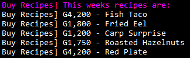
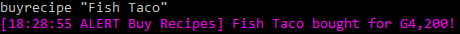

**Buy Recipes** is a [Stardew Valley](http://stardewvalley.net/) mod which lets you 
buy cooking recipes from the SMAPI console.

Each week on Sunday a new set of up to five recipes will be available to buy. These 
will be recipes that you do not already own. Prices are listed next to each item.

To buy a recipe, just type `buyrecipe <recipe name>`  
_If the recipe name has a space in it, put quotes around the name (like in the screenshot below)_

Future a development will allow you to buy recipes from a magazine rack in Pierre's shop.

## Contents
* [Installation](#installation)
* [Usage](#usage)
* [Versions](#versions)
* [See also](#see-also)

## Installation
1. [Install the latest version of SMAPI](http://canimod.com/guides/using-mods#installing-smapi).
2. Install the latest version of [this mod from Github](https://github.com/Denifia/StardewMods/releases).
3. Run the game using SMAPI.
4. Load a saved game.
5. After your game loads, the SMAPI console will output this weeks available recipes.

## Usage
### Buy a recipe
1. Run the game using SMAPI.
2. Load a saved game.
3. Type in `buyrecipe <recipe name>` and press enter.  
  _Replace `<recipe name>` with the name of the recipe you want to buy_  
  _If the recipe name has a space in it, put quotes around the name (like in the screenshot below)_

### See this weeks recipes
Each sunday the SMAPI console will list the weeks recipes but you can show the list on demand.
1. Run the game using SMAPI.
2. Load a saved game.
3. Type in `showrecipes` and press enter.  

## Versions
See [release notes](release-notes.md).

## See also
* [My other mods](../readme.md)