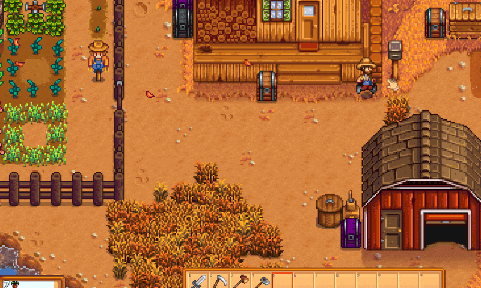
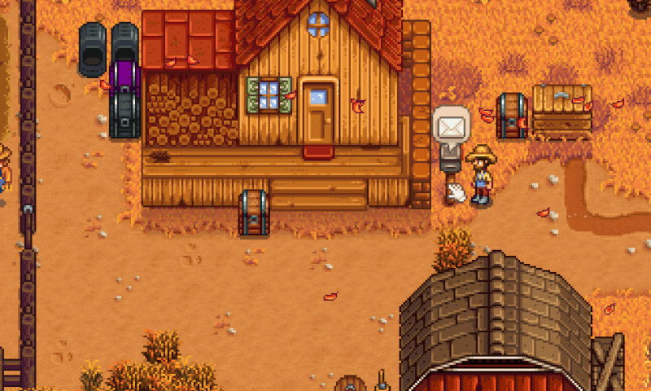

**Send Items** is a [Stardew Valley](http://stardewvalley.net/) mod which lets you 
send items to your other farms (saved games) or other players from around the world.

Sending 5 stone to myself...

Receiving the 5 stone in the mail...

Compatible with Stardew Valley 1.2+ on Windows. I've not tested anything else yet.

## Contents
* [Installation](#installation)
* [Usage](#usage)
* [Configuration](#configuration)
* [Versions](#versions)
* [See also](#see-also)

## Installation
1. [Install the latest version of SMAPI](http://canimod.com/guides/using-mods#installing-smapi).
2. Install [this mod from Nexus mods](http://www.nexusmods.com/stardewvalley/mods/1087).
3. Run the game using SMAPI.
4. As the game loads, the SMAPI console will output your "friend command" so you can send it to others.

## Usage
### Sending items
1. Right click on the letter box by your house (when no mail is waiting for you).
2. Select the farmer you want to send to.
3. Put an item (or stack) into the box.
4. Click ok.

* The item is taken out of your inventory right away and the "letter" is scheduled for delivery
* Each in-game night mail is delivered to receipent  
_So when you go to sleep to save your game, the mail is actually "sent" to another farmer_

### Handing out your "friend command"
**Note**: Please only hand out your friend code to people you trust to not abuse it.
1. Run the game using SMAPI.
2. Load a saved game.
3. Copy your "friend command" from the SMAPI console.  
  _It should appear in magenta automatically. If not, type in `si_me` and press enter_

### List your friends
1. Run the game using SMAPI.
2. Load a saved game.
3. Type in `si_myfriends` and press enter.  

### Adding online farmers (friends)
1. Ask your friend to send you their "friend command".  
  _Shown when you load the game or when you run `si_me` in the SMAPI console_
2. Run the game using SMAPI.
3. Load a saved game.
4. Paste in the "friend command" from step 1.  
  _This will be in the format of `si_addfriend <id> <name> <farm name>`_
5. Done! They will now show up as a farmer you can send to.

### Adding local farmers (local saved games)
You have two options here:  

**Big Bang**  
1. Run the game using SMAPI.
2. Load a saved game.
3. Type in `si_addlocalfarmers` and press enter.  
  _This will add all local farmers (including yourself) as friends_

**One at a time**  
1. Run the game using SMAPI.
2. Load a saved game.
3. Type in `si_myfriends`  and press enter to list the local farmers.
4. Pick a farmer (saved game) that you want to add.
5. Type in `si_addfriend <id> <name> <farm name>` and press enter.  
  _Replace `<id> <name> <farm name>` with the details of the farmer you want to add_

### Deleting farmers (friends or local saved games)
Again, you have two options here: 

**Big Bang**  
1. Run the game using SMAPI.
2. Load a saved game.
3. Type in `si_removeallfriends` and press enter.  

**One at a time**  
1. Run the game using SMAPI.
2. Load a saved game.
3. Type in `si_removefriend <id>` and press enter.  
  _Replace `<id>` with the id of the farmer you want to delete_

### Running the server locally
See [Send Items API](../SendItemsApi/readme.md)

## Configuration
The mod will work fine out of the box, but you can tweak its settings by editing the `config.json`
file if you want. These are the available settings:

| setting           | what it affects
| ----------------- | -------------------
| `CheckForUpdates` | Default `true`. Whether the mod should check for a newer version when you load the game. If a new version is available, you'll see a small message at the bottom of the screen for a few seconds. This doesn't affect the load time even if your connection is offline or slow, because it happens in the background.
| `ApiUrl`          | Default `http://senditemsapi.azurewebsites.net/api`. The URL to the web api. This allows you to send items to friends online. If you want to run completely "local only" then just remove this setting from the config file.

## Versions
See [release notes](release-notes.md).

## See also
* [Nexus mod](http://www.nexusmods.com/stardewvalley/mods/1087)
* [Discussion thread](http://community.playstarbound.com/threads/smapi-send-letters.132236/)
* [My other mods](../readme.md)
