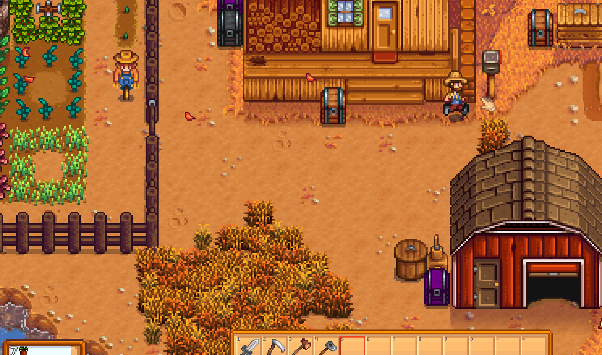
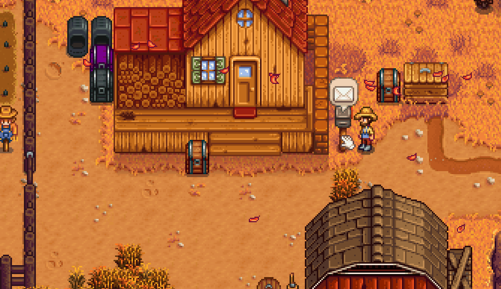

**SendLetters** is a [Stardew Valley](http://stardewvalley.net/) mod which lets you send items to your
other saved games or other players from around the world.

Compatible with Stardew Valley 1.1+ on Windows. I've not tested anything else yet.

## Contents
* [Installation](#installation)
* [Usage](#usage)
* [Configuration](#configuration)
* [Versions](#versions)
* [See also](#see-also)

## Installation
1. [Install the latest version of SMAPI](http://canimod.com/guides/using-mods#installing-smapi).
3. Install [this mod from Nexus mods](http://www.nexusmods.com/stardewvalley/mods/1087).
4. Run the game using SMAPI.

## Usage
### Send to your other farms (saved games)
1. Right click on the letter box by your house
2. Select the farm you want to send to
3. Put an item (or stack) into the box
4. Click ok

* Mail is delivered between 8am and 6pm each day

### Adding online friends
Coming soon...

### Running the server locally
Coming soon...

## Configuration
The mod will work fine out of the box, but you can tweak its settings by editing the `config.json`
file if you want. These are the available settings:

| setting           | what it affects
| ----------------- | -------------------
| `CheckForUpdates` | Default `true`. Whether the mod should check for a newer version when you load the game. If a new version is available, you'll see a small message at the bottom of the screen for a few seconds. This doesn't affect the load time even if your connection is offline or slow, because it happens in the background.
| `ApiUrl`          | The URL to the server. If you want to use my public server set to "http://denifiastardewsendletters.azurewebsites.net/api"

## Versions
See [release notes](release-notes.md).

## See also
* [Nexus mod](http://www.nexusmods.com/stardewvalley/mods/1087)
* [Discussion thread](http://community.playstarbound.com/threads/smapi-send-letters.132236/)
